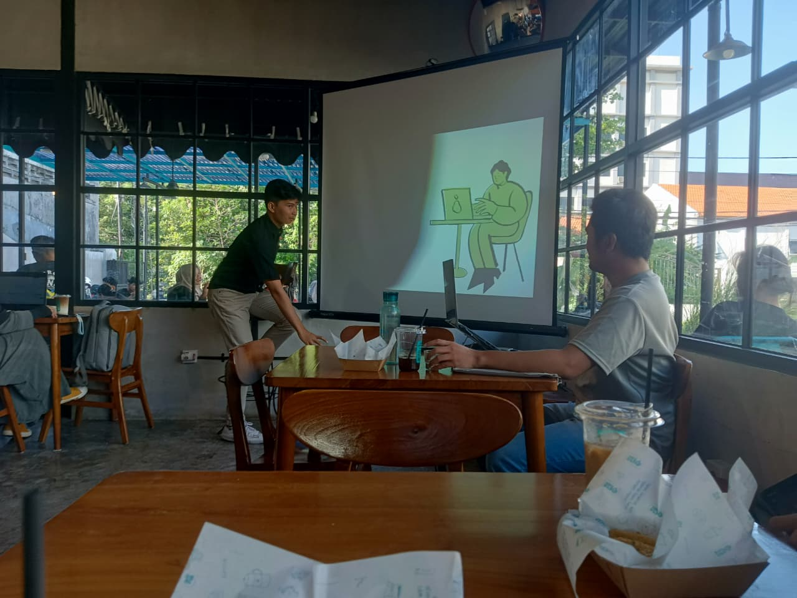
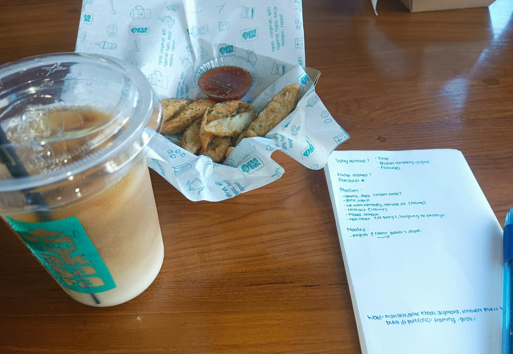

+++
date = '2025-09-13T21:35:28+07:00'
draft = false
title = "Workshop: Remote Work for Gen Z"
toc = true
tocOpen = true
isStarred = true
+++

Today, I attended a **workshop on Remote Work for Gen Z** at **Kedai Dee Aksara** from 3:00 PM to 5:00 PM WIB, led by **Kak Naufal Fakhri** ([LinkedIn](https://www.linkedin.com/in/naufal-fakhri-517214144/)). The entry fee was **Rp 20k**.

---

### Overview 🌟

Kak Naufal shared his experience **working remotely for the past 2 years** and why remote work is valuable:

- **Time flexibility**: Work when you are most productive  
- **Global opportunities**: Join international companies requiring digital skills  
- **Flexibility**: Balance work and life while staying productive  

He emphasized that **knowing your niche market** and building a **strong portfolio (CV 2.0)** are critical.

---

### Platforms to Find Remote Work 🌐

**Project-based platforms:** Upwork, Fiverr, Fastwork  
**Full-time remote:** Glints, Toptal, We Work Remotely, Remote.com  
**Startups:** Tech in Asia  
**Direct applications:** Indeed, LinkedIn, or company websites (apply via website or email HR)  

---

### Must-Have Skills 🗝️

- **English fluency** – practice continuously  
- **Portfolio** – show real evidence of your work  

---

### Action Framework 🛠️

Kak Naufal recommends a **3-step approach**:

1. **Prepare** – Build 3 types of portfolio samples  
2. **Learn** – Attend bootcamps or short courses to strengthen skills  
3. **Problem → Proof → CTA** – Present a challenge you solved, show proof in your portfolio, and include a clear Call-to-Action  

---

### Crafting a Freelance Header ✏️

Use this 1-line freelance headline format:  

**[Role] who helps [target audience] achieve [specific outcome] in [timeframe]**  

**Examples from the workshop:**  

- *Network Engineer who helps small-to-medium businesses validate and deploy resilient, low-downtime network architectures under one week.*  
- *Network Trainer who helps 30-student cohorts achieve an 80% MTCNA pass rate in a 2-day intensive bootcamp.*  

---

### Personal Notes & Insights 💡

- **Work style**:  
  - Introverts → invest in a cozy workspace  
  - Extroverts (like Kak Naufal) → work in cafes and meet friends  
- **Portfolio proof** is key – dummy projects are fine to demonstrate skills  
- **Framing & branding**: be result-oriented, quantify achievements  
- **Specialization matters**: pick your expertise and refine continuously  
- **Manifest**, **Aone Schools**, **Algonova** – words/concepts to note  

---

Remote work is **not just about flexibility**. It’s about strategic preparation, continuous learning, and measurable results. By following this framework, Gen Z freelancers can confidently navigate the global remote work landscape.

Snack bonus pic
